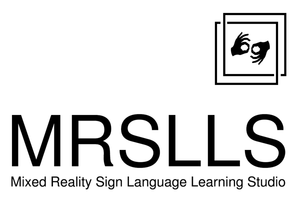
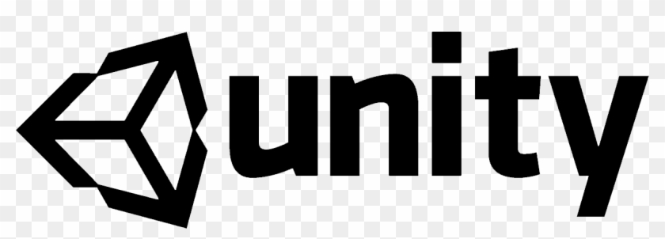

#MRSLLS

ASL Mixer Reality Learning Studio

This project was developed at the 2020 MIT Reality Hacks Hackathon. The purpose is to pioneer the way the we teach sign language now the we have new mediums and platforms like VR/AR.

## Installation 
Nreal, follow their guide for setting up the Unity environment for the Dev Kit:
https://developer.nreal.ai/develop/unity/android-quickstart

Hololens 2, follow their guide for setting up the Unity environment for Windows:
https://docs.microsoft.com/en-us/windows/mixed-reality/mrlearning-base

Now to go to our website to download the unity binary to install on your Androin phone:

https://mrslls.glitch.me/

## Installation Hololens 2

## Contributing
***
## Getting Started

Must have unity Unity 2019.2.18 installed inorder to do development for the Nreal or Hololens 2 platforms:

## Nreal
---
https://developer.nreal.ai/develop/unity/android-quickstart

## Hololens 2
---
https://docs.microsoft.com/en-us/windows/mixed-reality/mrlearning-base-ch1

